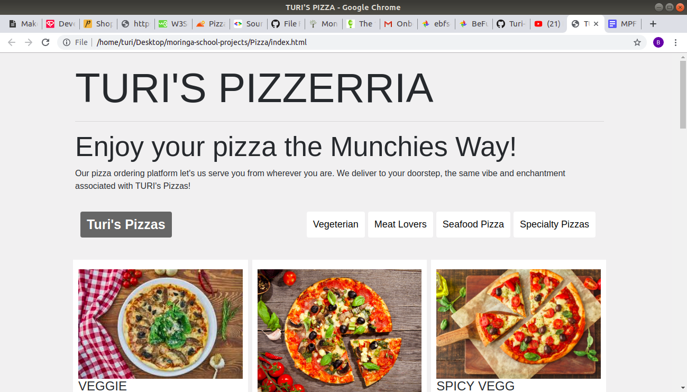

# Turi's Pizzerria

Turi's Pizzerria allows customers to order their favorite pizzas and have them delivered to their doorstep. The user can choose what size they,d like from large, medium to small and what crust they'd like for that pizza. They can add their favorite toppings and the total cost and delivery time is communicated to them through a pop up after the session. 

## Author:
Breldan Muthaka

## Screenshot:
  

## Installation

To install the project it is necessary to follow these steps:


* Open https://github.com/Turi-byte/pizza. On the top right corner of your screen, you should see a button with the text 'Fork'. 
* Clicking on this button should start the process of copying the project/repository to your own account.Click on that button which should result in a modal prompting you to choose the account to which you want to fork.
* Select your account name which should take you to the repo you forked in your account. For example, if your GitHub username is 'Turi-byte', you should select it and not anything else that appears in the modal. This may take a couple of seconds so be patient as the process takes place.
* To know that the forking process is complete, check the top left corner of your repo. You should be in your account in a repo with the same name as the original repository (your_username/pizza). This shows that the forking process is complete.
* Having copied the repo to your own account, you can then proceed to clone it.Run the git clone command to clone the repo to your preferred location.
* Navigate to inside the cloned repository by using the change directory (cd) command.
* Open your editor by using the command atom . for Atom users or code . for Visual Studio Code users.
* You are now ready to inspect and make modifications to the project.


## Technologies

* HTML
* CSS
* JS
* Bootstrap
* jQuery

## Contributing
Pull requests are welcome. For major changes, please open an issue first to discuss what you would like to change.

Please make sure to update tests as appropriate.

## Contact
You can reach me at
```bash
turithatguy@legends.com
```


## License
[MIT](https://choosealicense.com/licenses/mit/)
